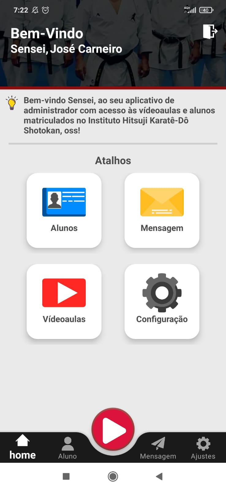
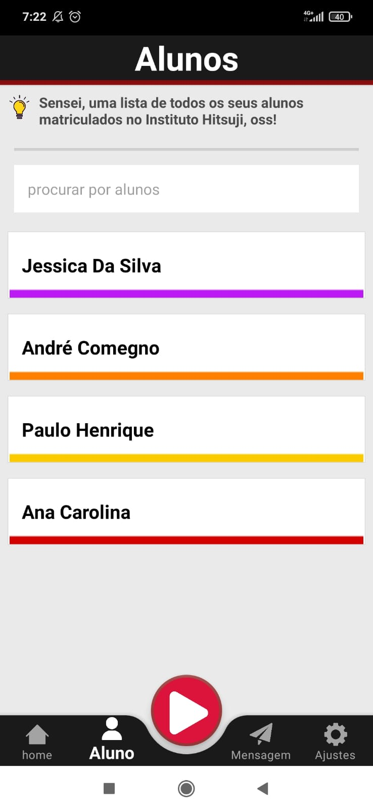
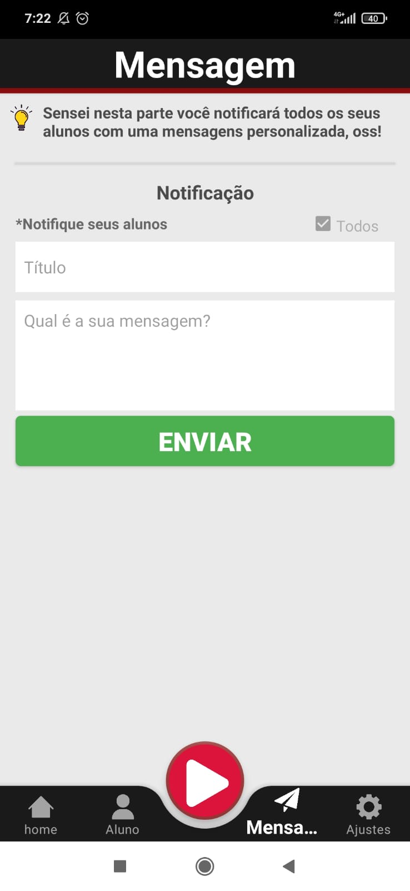
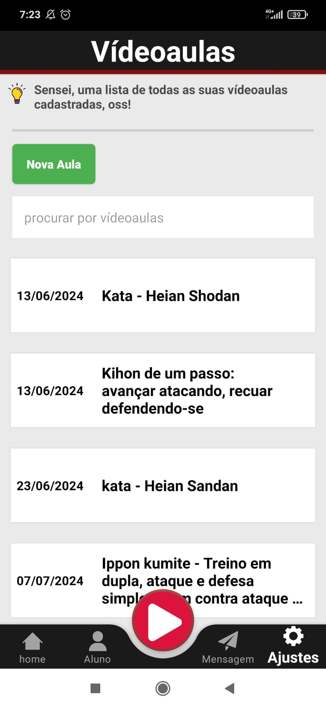
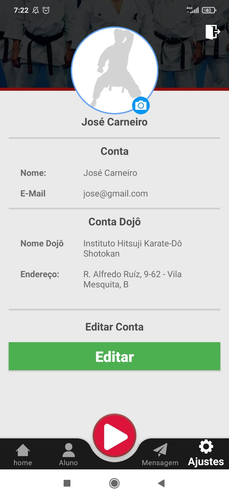
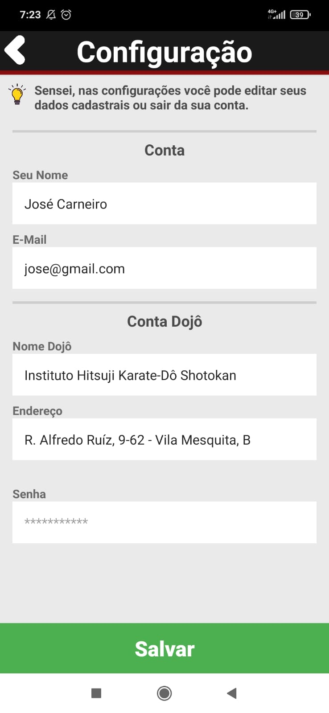
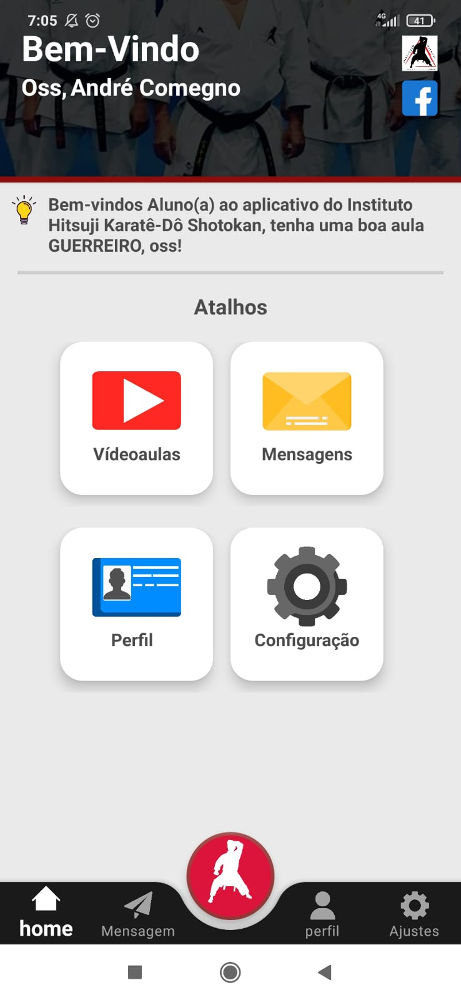
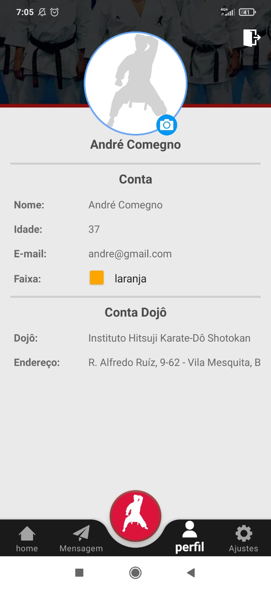
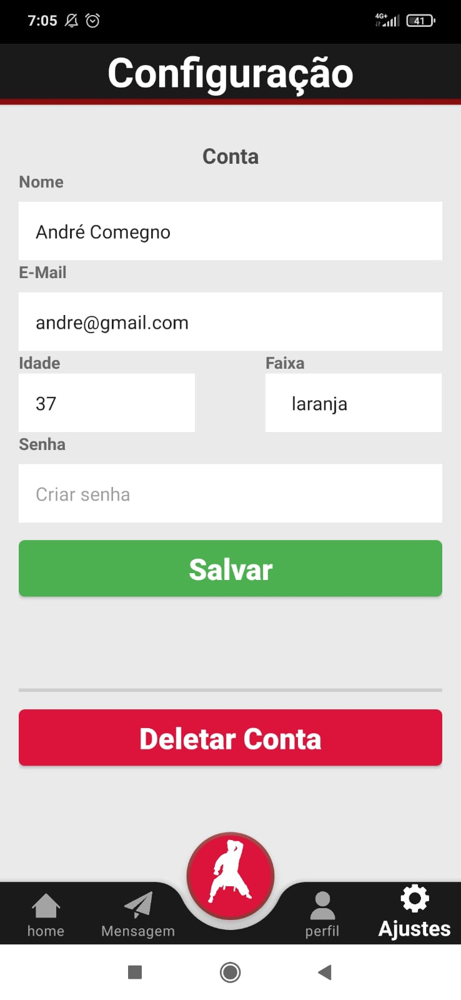
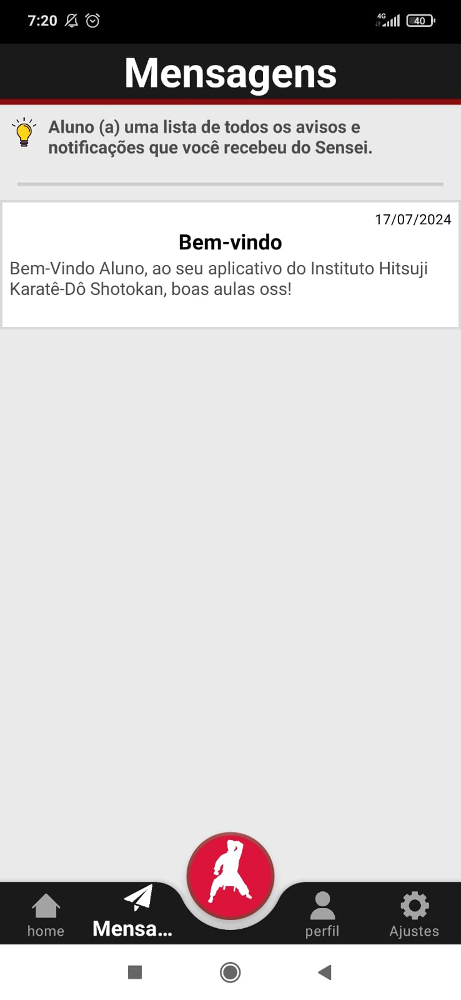

  <a href="https://opensource.org/licenses/MIT">
       
                                                                                   
  </a>

 #
 

   

# Introdução
A empresa Instituto Hitsuji Karatê-Dô Shotokan do "[Sensei José Carneiro][facebook]" viu uma necessidade de uma aplicativo de aulas online para os seus alunos, com isso foi desenvolvido o aplicativo Hitsuji Karatê-Dô Shotokan.  
Com objetivo de facilitar aos seus alunos o acompanhamento das aulas online via Youtube, disponíveis em uma lista das videoaulas mais atuais com um menu organizando os pilares do Karate, Kihon, Kata e Kumite. E para os alunos não perderem nenhuma novidade do instituto Hitsuji o aplicativo é capaz de enviar ou receber mensagens e notificações de aviso do Sensei. 
O aplicativo foi desenvolvido na linguagem Kotlin com o banco de dados Firebase, e está disponível para download na sua versão beta.

## Características
O aplicativo foi desenvolvido na linguagem Kotlin com o banco de dados Firebase, disponível para download na sua versão beta. 
Foram desenvolvidos dois aplicativos, um administrador que será disponível somente para o Sensei e um segundo aplicativo disponível para os alunos matriculados.
Com o aplicativo Hitsuji Karatê-Dô Shotokan você vai conseguir fazer:

Aplicativo Administrador
- **Login**: acessar conta autenticada com validação Firebase Authentication
- **Cadastrar**: criação de conta com autenticação Firebase Authentication.
- **Dashboard**: mensagens de boas vindas com personalização de nome, atalhos de acesso rápido.
- **Mensagens**: enviar notificações de avisos individuais ou todos para os alunos.
- **Videoaulas**: adicionar novas videoaulas para os seua alunos.
- **Configurações**: visualização do perfil dos alunos com dados cadastrados.

Aplicativo Aluno
- **Login**: acessar conta autenticada com validação Firebase Authentication
- **Cadastrar**: criação de conta com autenticação Firebase Authentication.
- **Dashboard**: mensagens de boas vindas com personalização de nome, atalhos de acesso rápido.
- **Mensagens**: visualizar todas as notificações e avisos recebidos.
- **Videoaulas**: videoaulas separadas por três opções: kata, kumite, kihon.
- **Aulas**: assistir todas as videoaulas disponíveis.
- **Configurações**: visualização do perfil dos alunos com dados cadastrados.

## Screenshots - App Admin

 
    
        
    
     
       
    
    

## Screenshots - App Aluno

    
        
    
     
    
    
    

## Instalação
Faça o downlaod da nossa versão mais atual disponível: [Hitsuji Karate-Dô Shotokan][apk]
 
### 👾 Linguagens e Ferramentas

 

#

[facebook]: https://www.facebook.com/jose.carneiro.167
[apk]: https://github.com/andrecomegno/HitsujiKarate/releases
