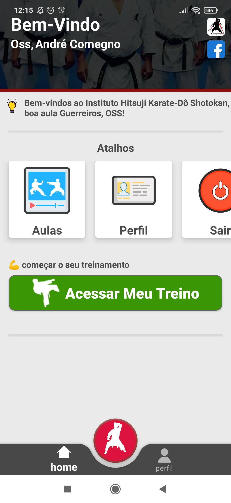
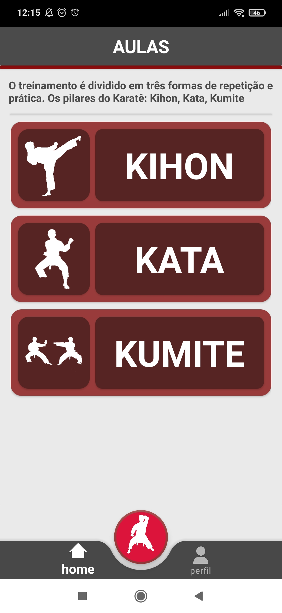
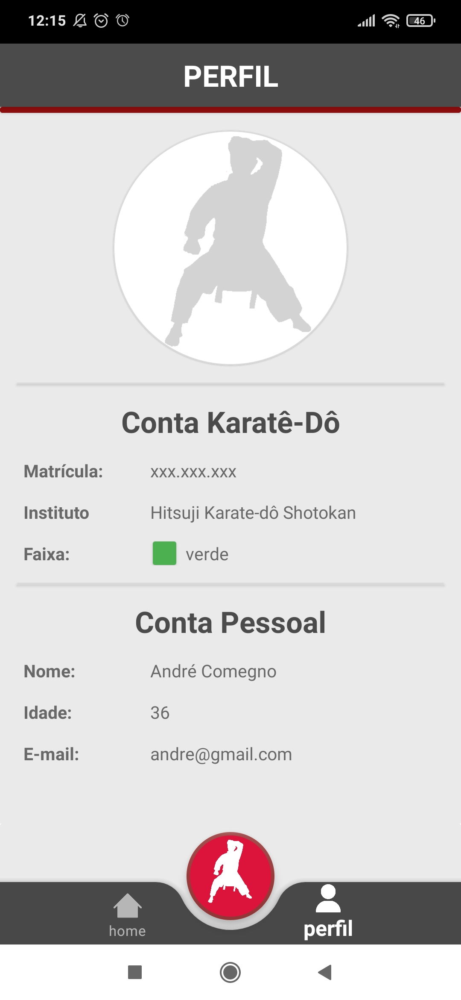
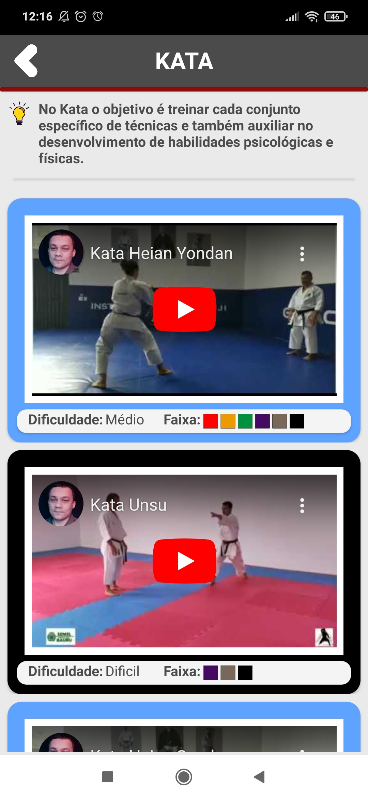

<p>
  <a href="https://opensource.org/licenses/MIT">
       
                                                                                   
  </a>
</p>

 #
 
<p align="center">
   
</p>

# Introdução
<p>
A empresa Instituto Hitsuji Karate-Dô Shotokan do Sensei José Carneiro viu uma necessidade de uma aplicativo de aulas online para os seus alunos, com isso foi desenvolvido o aplicativo Hitsuji Karate-Dô Shotokan. <br/>
Com objetivo de facilitar aos seus alunos o acompanhamento das aulas online via Youtube, os vídeos estão separados pelos os pilares do Karate, Kihon, Kata e Kumite. O aplicativo foi desenvolvido na linguagem Kotlin com o banco de dados Firebase, e está disponível para download na sua versão beta.
</p>

## Características
<p> O aplicativo foi desenvolvido no Android Studio na linguagem Kotlin com o banco de dados FireBase, disponível para download na sua versão beta. 
  Com o aplicativo Hitsuji Karate-Dô Shotokan você vai conseguir fazer: </p>

- **Login**: acessar conta autenticada via firebase, tela esqueceu senha autenticada via firebase
- **Cadastrar**: criação de conta de alunos separados por id e gravadas via firebase.
- **Dashboard**: mensagens de boas vindas com personalização de nome, atalhos de acesso rápido.
- **Videos Aulas**: iframe do youtube das aulas separadas por três opções: kata, kumite, kihon.
- **Aulas**: visualização de uma lista com descrições das aulas e dificuldades.
- **Configurações**: visualização do perfil dos alunos com dados cadastrados. 

## Screenshot
<div style="display: inline"> 
    
    
    <br/>
    
    
</div>

## Instalação
<p>Faça o downlaod da nossa versão mais atual disponível </p>

```bash
# versão mais atual
https://github.com/andrecomegno/HitsujiKarate/releases
```
 
### 👾 Linguagens e Ferramentas


<br>
